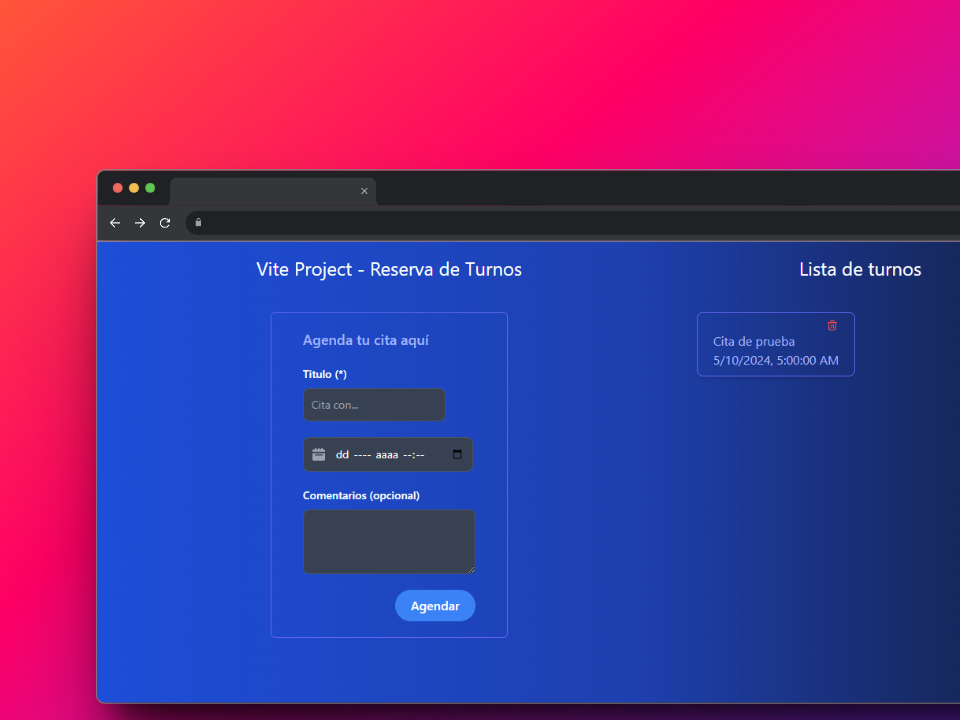

# Aplicación Web: Reserva de Turnos

#### Proyecto web desarrollado con React.js + Vite.js la cual consume una API REST desarrollada con Python + Django. El proyecto posee las funcionalidades básicas de un C.R.U.D.

### Casos de Uso
- USUARIO:
  - [ ] Registrarse
  - [ ] Iniciar Sesión

- TURNOS:
  - [x] Agendar Turno
  - [x] Visualizar turnos por usuario
  - [x] Eliminar Turno
  - [ ] Actualizar Turno 

### CAPTURA
